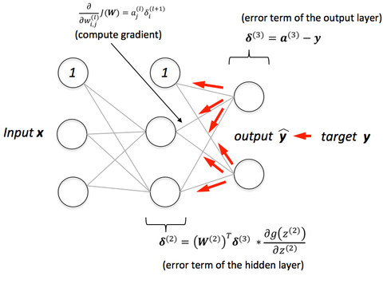

= TensorFlow
Sebastian De Ro <der16120@spengergasse.at>
v1.0, 2018-03-18
:toc:
:toclevels: 10

== Foreword

https://www.tensorflow.org/[TensorFlow] is a machine learning library by Google,
that abstracts much of the mathematical background of machine learning, by providing
configurable implementations of commonly found algorithms.

Even though it abstracts much of the needed mathematical knowledge for creating algorithms
that provide any useful functionality, there is still quite a learning curve for being able to use
this library productively.

A knowledge of the different algorithms that are used in data science aswell as hyper parameter
tuning is needed. A knowledge of statistics is also very useful. It is also very important that you 
know how to clean your data and what defines useful data, so that you can feed your TensorFlow setups
a good training and testing dataset. The best algorithms still need good data to be able to provide any 
useful result.

In this paper we will look at all the different parts that you need to know to be able to create your own
deep learning setups with TensorFlow and why you would even want to do that.

Let's start by answering the following simple questions:
*_What is it? Why do I need it? How can I use it?_*

== What is TensorFlow?

https://www.tensorflow.org/[TensorFlow] is a computation library written by Google.
It represents deep learning computations with data flow graphs. In the words of Google on their website:

"TensorFlow™ is an open source software library for numerical computation using data flow graphs. 
Nodes in the graph represent mathematical operations, while the graph edges represent the multidimensional 
data arrays (tensors) communicated between them." 
-- www.tensorflow.org

== Why do I need it?

In deep learning especially, doing it yourself results in a lot of repetitive code. 
In Python, the code base will run quite slowly which is not ideal when you are training on big datasets, 
as this means that your algorithm will be repeating the same task many times to train a set of weights using a training dataset.
Repetition calls for good performance that Python is just not able to deliver.

=== Machine Learning in Python

We can circumvent this by using libraries like http://www.numpy.org/[*Numpy*], 
that import compiled C and C++ libraries to python and offload performance intensive tasks to these compiled libraries.
This allows for safe and scientific computation in python.

But even with these libraries reinventing the *_wheel_*(get it?) is not really optimal. 
Therefore a group of great people created a library that includes many useful machine learning algorithms, 
like clustering, regression, classification and others, like naive-bayes. This library is calles http://scikit-learn.org[*SciKit Learn*].

So now we know of two libraries that can save us hundreds of lines of code and make our code more efficient.
But one we are still missing is https://pandas.pydata.org/[*Pandas*].
Pandas is a data structure and analysis library that we can use to clean our dataset and analyze it.

This is all you need to create basic machine learning algorithms that can already do some cool stuff. 
But when you want to explore deep learning it gets more complicated.
Deep learning is a part of machine learning that uses Artificial Neural Networks(_ANNs_) to simulate a biological learning approach.

=== How do Feed Forward ANNs work?
ANNs are made up of nodes and connections. The nodes add up all incoming connections and when it reaches a certain treshhold,
the sum is used as the output of the node. The incoming connections all have a weight assigned to them which the input is multiplied with.

These weights are what makes ANNs "`smart`", as they are adjusted to provide the desired output from the node.

.Simple Neural Network
[#img-anns]
[caption="Figure 1: ",link=https://towardsdatascience.com/applied-deep-learning-part-1-artificial-neural-networks-d7834f67a4f6]
image::media/ann.png[Artificial Neural Networks, 500, 500]

==== Back propagation
Back propagation is the fancy term for adjusting the weights through the whole network.
This is done by predicting a value and then calculating the error between the prediction and the expected value.
Then the Feed Forward ANN is walked through backwards by the algorithm, comparing every result with the expected and subtracting the error.
This is done many times with a big training dataset.

.Backpropagation
[#img-backpropagation]
[caption="Figure 2: ",link=https://sebastianraschka.com/images/faq/visual-backpropagation/backpropagation.png]

.Hyper Parameters
Learning Rate::
 * is a multiplier that is multiplied with the error to form the substracted gradient
 * is used to prevent overfitting the dataset
Iterations::
 * is, as the name implies, how often to train on the dataset. The more often this is done the better the prediction
 * a too high number of iterations can again cause overfitting of the dataset

TIP: Hyper parameters are parameters that change the behaviour of the algorithm

TIP: Overfitting is a term used to describe the algorithm being trained so well to a specific dataset that it doesnt perform well on new data

==== Deep Learning

What differenciates deep learning from standard neural networks is that deep learning, as the name implies,
uses a deep architecture of multiple layers of neural nodes. Some architectures even use a variety of different layer types.

.Typical Simple ANN versus a deep learning ANN
[#img-comparing]
[caption="Figure 3: ",link=http://www.global-engage.com/wp-content/uploads/2018/01/Deep-Learning-blog.png]
image::media/deeplearning.png[ML ANN vs DL ANN comparisson, 500, 500]

We will not go into detail about the differnet types of ANNs, but for the curious here is a 
https://en.wikipedia.org/wiki/Types_of_artificial_neural_networks[Link].

==== How it ties into TensorFlow

All these concepts might have been something new for you, but either way you now have some knowledge about the basics
of machine learning in python. As you might have recognized, it is not that bad as long as you stay out of deep learning.
To be able to simply create more advanced structures we need to look at libaries that alleviate
the workload that would typically be in order.

There are many popular frameworks and libraries in this space
but these two are the most popular two.
Lets compare them:

.Deep Learning Libraries
https://www.tensorflow.org/[TensorFlow]::
* Big community
* Backed by Google
* Static graph definition
* cool visualization
http://pytorch.org/[PyTorch]::
* Torch is backed by Facebook
* Relatively new
* Gaining momentum quickly
* Dynamic graph definition
* More abstraction

We will be looking at TensorFlow as it has a bigger community and
has been in use in production for longer than PyTorch.

=== How can I use it?

When you want to use TensorFlow there are two options I would consider.
If you know your way around python well enough that you feel comfortable
dealing with version conflicts and incompatibilities under various Python
versions then you can go ahead and attempt to get all dependencies up and running
by yourself. Another possibiliy is to use the https://www.anaconda.com/what-is-anaconda/[Anaconda] Data Science platform
to have everything running after a simple install.

==== Installing it manually

Installing TensorFlow yourself can be quite a pain.
First you need to decide if you want GPU support, which can greatly increase the performance
of your algorithms.

===== Installing CUDA

If you decided that you want GPU support and you have an AMD GPU, then tough luck!
Otherwise, if you own an NVIDIA GPU, you will have to install CUDA.

.What you will need
* CUDA Toolkit
* NVIDIA Drivers associated with the cuda version
* cuDNN
* CUDA Compute Capability 3.0 or better GPU

WARNING: Check the https://www.tensorflow.org/install/install_windows[TensorFlow site] for the correct versions

Follow the instructions on the NVIDIA site and the installers.

WARNING: Please note, that the versions are very important, slight deviations can cause
major headaches

===== Installing TensorFlow

https://wiki.python.org/moin/BeginnersGuide/Download[Install Python 3.6] using the installer or using a package manager.

[source, shell]
----
# execute only one command
# with gpu support
pip3 install --upgrade tensorflow-gpu
# without gpu support
pip3 install --upgrade tensorflow
----

==== Installing it with Anaconda

Just follow the installer instructions and use common sense.

=== Lets look at some code

With your working tensorflow installation we can now get to work.

.app.py
[source, python]
----
import tensorflow as tf

hello = tf.constant('Hello, TensorFlow!')
sess = tf.Session()
print(sess.run(hello))
----

If the code above, which was taken from the install guide of TensorFlow,
outputs 'Hello, TensorFlow!' or b'Hello, TensorFlow!' your install is working.

There are many 
https://www.tensorflow.org/tutorials/[code examples for TensorFlow]
on the website, which you can use to understand the code feeling of TensorFlow.

Lets look at one of them.

.linear-classifier.py
[source, python]
----
import time

# Specify the feature(s) to be used by the estimator.
image_column = tf.contrib.layers.real_valued_column('images', dimension=784)
estimator = tf.contrib.learn.LinearClassifier(feature_columns=[image_column], n_classes=10)

# Train.
start = time.time()
estimator.fit(input_fn=train_input_fn, steps=2000)
end = time.time()
print('Elapsed time: {} seconds'.format(end - start))

# Evaluate and report metrics.
eval_metrics = estimator.evaluate(input_fn=eval_input_fn, steps=1)
print(eval_metrics)
----

This creates a simple Linear Classifier that is trained on a training dataset.

[source, python]
----
image_column = tf.contrib.layers.real_valued_column('images', dimension=784)
----
This code creates a image_column, which is a type of layer provided by TensorFlow.
It is used to define the dimensionality used for the LinearClassifier.

[source, python]
----
estimator = tf.contrib.learn.LinearClassifier(feature_columns=[image_column], n_classes=10)
----
Here we create a LinearClassifier with the feature column that we defined above. we specify 10 as the number of classes the classifier will use
to classify input.
This means that every input will be assigned one of 10 classes

[source, python]
----
estimator.fit(input_fn=train_input_fn, steps=2000)
----
This trains the LinearClassifier on a data set.

[source, python]
----
eval_metrics = estimator.evaluate(input_fn=eval_input_fn, steps=1)
----
Here we get a prediction from the Classifier.

=== Conclusion

A good source to continue learning from is the already mentioned https://www.tensorflow.org/tutorials/[page with code examples]

TensorFlow abstracts and simplifies the workflow when working with machine learning and deep learning algorithms, which we can use
to provide valuable functionality in our products and projects.